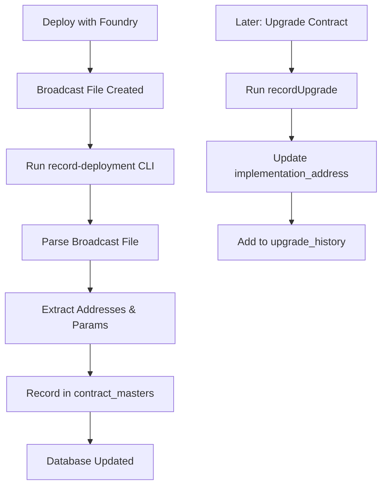

# Trade Finance Deployment Recording System

This system provides structured interfaces and services for recording UUPS upgradeable contract deployments based on CONTRACT_DEPLOYMENT_PARAMETERS.md.

## 📁 Files Created

### Types
- `/backend/src/types/trade-finance/deployment-records.ts` - TypeScript interfaces matching CONTRACT_DEPLOYMENT_PARAMETERS.md

### Services
- `/backend/src/services/trade-finance/DeploymentRecordingService.ts` - Database recording service

### Scripts
- `/backend/src/scripts/record-trade-finance-deployment.ts` - CLI tool for recording deployments

### Database
- `/backend/migrations/add_uups_proxy_tracking.sql` - Database indexes and documentation

## 🚀 Quick Start

### Step 1: Apply Database Migration

```bash
# Use Supabase MCP to execute the migration
# Or apply via Supabase dashboard SQL editor
cat backend/migrations/add_uups_proxy_tracking.sql
```

### Step 2: Deploy Contracts (Example: Phase 1)

```bash
cd frontend/foundry-contracts

# Set environment variables
export DEPLOYER_ADDRESS=0x...
export SUPER_ADMIN_ADDRESS=0x...
export HOODI_RPC_URL=https://...
export PRIVATE_KEY=0x...

# Deploy Phase 1
forge script script/trade-finance/DeployPhase1Governance.s.sol \
  --rpc-url $HOODI_RPC_URL \
  --broadcast \
  --verify \
  -vvvv
```

### Step 3: Record Deployment

```bash
cd ../../backend

# Record deployment from broadcast file
npm run record-deployment -- \
  --network hoodi_testnet \
  --environment staging \
  --broadcast-file ../frontend/foundry-contracts/broadcast/DeployPhase1Governance.s.sol/8898/run-latest.json \
  --phase 1
```

## 📊 What Gets Recorded

For each UUPS contract, the system records:

### Base Information
- Network, environment, contract type
- Proxy address (main interface)
- Implementation address
- Version, ABI, ABI hash
- Deployment transaction hash
- Deployer address
- Initial owner

### Initialization Parameters
Captures exact parameters passed to `initialize()`:

```typescript
// Example: PoolAddressesProvider
{
  marketId: "ChainCapital-Commodities",
  owner: "0x..."
}

// Example: DutchAuctionLiquidator
{
  pool: "0x...",           // CommodityLendingPool proxy
  aclManager: "0x...",     // ACLManager proxy
  priceOracle: "0x...",    // CommodityOracle proxy
  owner: "0x..."
}
```

### Deployment Data
```typescript
{
  compiler_version: "0.8.28",
  optimization: true,
  runs: 200,
  chain_id: 8898,
  deployment_block: 1234567,
  deployment_script: "DeployPhase1Governance.s.sol",
  deployment_timestamp: "2026-01-04T12:00:00Z",
  proxy_address: "0x...",
  implementation_address: "0x...",
  initialization_params: {...}
}
```

### Contract Details
```typescript
{
  features: ["upgradeable", "uups", "ownable"],
  upgrade_pattern: "UUPS",
  category: "governance",
  upgrade_history: [...]
}
```

## 📝 Using the Service

### Record Single Deployment

```typescript
import { deploymentRecordingService } from './services/trade-finance';
import type { DeploymentRecord } from './types/trade-finance';

const record: DeploymentRecord = {
  network: 'hoodi_testnet',
  environment: 'staging',
  contract_type: 'pool_addresses_provider',
  contract_address: '0x...', // Proxy address
  proxy_address: '0x...',
  implementation_address: '0x...',
  version: 'v1.0.0',
  abi: [...],
  abi_hash: '...',
  deployment_tx_hash: '0x...',
  deployed_by: '0x...',
  deployed_at: new Date(),
  initial_owner: '0x...',
  initialization_params: {
    marketId: 'ChainCapital-Commodities',
    owner: '0x...',
  },
  deployment_data: {
    compiler_version: '0.8.28',
    optimization: true,
    runs: 200,
    chain_id: 8898,
    deployment_timestamp: new Date().toISOString(),
  },
  contract_details: {
    features: ['upgradeable', 'uups', 'ownable'],
    upgrade_pattern: 'UUPS',
    category: 'governance',
  },
};

await deploymentRecordingService.recordDeployment(record);
```

### Record Upgrade

```typescript
await deploymentRecordingService.recordUpgrade(
  '0xProxyAddress',
  'hoodi_testnet',
  'staging',
  {
    version: 'v2.0.0',
    implementation: '0xNewImplAddress',
    reason: 'Add emergency pause functionality',
    tx_hash: '0x...',
    upgraded_by: '0x...',
  }
);
```

### Query Deployments

```typescript
// Get single contract
const contract = await deploymentRecordingService.getContract(
  '0xProxyAddress',
  'hoodi_testnet',
  'staging'
);

// Get all governance contracts
const govContracts = await deploymentRecordingService.getContractsByCategory(
  'governance',
  'hoodi_testnet',
  'staging'
);

// Get upgrade history
const history = await deploymentRecordingService.getUpgradeHistory(
  '0xProxyAddress',
  'hoodi_testnet',
  'staging'
);

// Get proxy address by type
const proxyAddress = await deploymentRecordingService.getProxyAddress(
  'pool_addresses_provider',
  'hoodi_testnet',
  'staging'
);
```

## 🗂️ Database Structure

All data stored in existing `contract_masters` table using JSONB fields:

```sql
SELECT 
  contract_type,
  contract_address,  -- Proxy address for UUPS
  version,
  deployment_data->>'proxy_address' as proxy,
  deployment_data->>'implementation_address' as implementation,
  deployment_data->'initialization_params' as init_params,
  contract_details->'upgrade_history' as upgrades
FROM contract_masters
WHERE network = 'hoodi_testnet'
  AND environment = 'staging'
  AND contract_details->>'category' = 'governance';
```

## 🔄 Deployment Workflow



## 🎯 Benefits

### 1. **Complete Audit Trail**
Every deployment parameter is recorded exactly as used

### 2. **UUPS Proxy Tracking**
Clear separation of proxy vs implementation addresses

### 3. **Upgrade History**
Full history of all upgrades with reasons and transactions

### 4. **Type Safety**
TypeScript interfaces prevent parameter mistakes

### 5. **Queryable**
JSONB allows flexible queries on any field

## 📋 Next Steps

### Current Status
- ✅ Types defined for all 27 contracts
- ✅ Recording service implemented
- ✅ CLI tool created for Phase 1
- ✅ Database migration documented
- ⬜ CLI tool for Phases 2-5 (TODO)
- ⬜ Frontend integration (TODO)

### Week 1: Database & Recording
- [ ] Apply database migration
- [ ] Test recording Phase 1 deployment
- [ ] Verify data in contract_masters
- [ ] Regenerate Prisma schema

### Week 2: Expand CLI
- [ ] Add Phase 2 recording to CLI
- [ ] Add Phase 3 recording to CLI
- [ ] Add Phase 4 recording to CLI
- [ ] Add Phase 5 recording to CLI

### Week 3: Integration
- [ ] Update existing services to query contract_masters
- [ ] Create frontend components for viewing deployments
- [ ] Add upgrade history display

## 🔍 Example Queries

### Get All Trade Finance Contracts
```sql
SELECT 
  contract_type,
  contract_address as proxy,
  version,
  contract_details->>'category' as category
FROM contract_masters
WHERE contract_details->>'category' IN ('governance', 'core', 'risk', 'rewards', 'liquidation', 'treasury')
  AND network = 'hoodi_testnet';
```

### Find Contracts Needing Upgrade
```sql
SELECT 
  contract_type,
  contract_address,
  version,
  jsonb_array_length(contract_details->'upgrade_history') as upgrade_count
FROM contract_masters
WHERE deployment_data->>'implementation_address' IS NOT NULL
  AND version != 'v1.0.0'
ORDER BY upgrade_count DESC;
```

### Get Initialization Parameters
```sql
SELECT 
  contract_type,
  deployment_data->'initialization_params' as params
FROM contract_masters
WHERE contract_type = 'dutch_auction_liquidator';
```

## 📚 Reference

- CONTRACT_DEPLOYMENT_PARAMETERS.md - Complete parameter documentation
- TRADE_FINANCE_UPGRADEABILITY_*.md - Upgradeability guides
- deployment-records.ts - TypeScript interfaces
- DeploymentRecordingService.ts - Service implementation
