# Chain Capital Production Architecture

Below is a comprehensive architecture diagram showing all technologies, components, and infrastructure for the Chain Capital Production platform.

```mermaid
graph TB
    %% MAIN COMPONENTS
    Client["Client Browser"]
    Frontend["Frontend (Vite + React + TypeScript)"]
    Backend["Backend (API/Server)"]
    Database["Database (Supabase PostgreSQL)"]
    Blockchain["Blockchain Infrastructure"]
    
    %% FRONTEND COMPONENTS
    Frontend --> UI["UI Components (Radix UI/shadcn)"]
    Frontend --> Pages["Pages"]
    Frontend --> Routes["Routes"]
    Frontend --> Hooks["Custom Hooks"]
    Frontend --> StateManagement["State Management (@tanstack/react-query)"]
    Frontend --> FrontendServices["Frontend Services"]
    
    %% UI COMPONENTS BREAKDOWN
    UI --> Common["Common UI Components"]
    Common --> Buttons["Buttons"]
    Common --> Forms["Form Components"]
    Common --> Tables["Data Tables (@tanstack/react-table)"]
    Common --> Navigation["Navigation Components"]
    Common --> Modals["Dialog/Modal Components"]
    
    %% PAGES & ROUTES
    Pages --> Dashboard["Dashboard Page"]
    Pages --> Investors["Investor Management"]
    Pages --> Projects["Project Management"] 
    Pages --> Tokens["Token Management"]
    Pages --> Wallets["Wallet Management"]
    Pages --> Compliance["Compliance Interface"]
    Pages --> Documents["Document Center"]
    
    %% FRONTEND SERVICES
    FrontendServices --> AuthService["Auth Service"]
    FrontendServices --> APIClient["API Client"]
    FrontendServices --> NotificationService["Notification Service"]
    FrontendServices --> ValidationService["Validation Service"]
    
    %% BACKEND COMPONENTS
    Backend --> Auth["Authentication/Authorization"]
    Backend --> RESTEndpoints["REST API Endpoints"]
    Backend --> BusinessLogic["Business Logic"]
    Backend --> SupabaseFunctions["Supabase Functions"]
    Backend --> Migrations["Database Migrations"]
    
    %% SERVICE LAYERS
    BusinessLogic --> Services["Service Modules"]
    
    %% SERVICE MODULES BREAKDOWN
    Services --> AuditService["Audit Service"]
    Services --> AuthService2["Auth Service"]
    Services --> BlockchainService["Blockchain Service"]
    Services --> CaptableService["Cap Table Service"]
    Services --> ComplianceService["Compliance Service"]
    Services --> DashboardService["Dashboard Service"]
    Services --> DeploymentService["Deployment Service"]
    Services --> DFNSService["DFNS Service"]
    Services --> DocumentService["Document Service"]
    Services --> GuardianService["Guardian Service"]
    Services --> IntegrationsService["Integrations Service"]
    Services --> InvestorService["Investor Service"]
    Services --> PolicyService["Policy Service"]
    Services --> ProjectService["Project Service"]
    Services --> RampService["Ramp Service"]
    Services --> RealtimeService["Realtime Service"]
    Services --> RedemptionService["Redemption Service"]
    Services --> RuleService["Rule Service"]
    Services --> TokenService["Token Service"]
    Services --> UserService["User Service"]
    Services --> WalletService["Wallet Service"]
    Services --> WorkflowService["Workflow Service"]
    
    %% WALLET SERVICE BREAKDOWN
    WalletService --> WalletABI["ABI"]
    WalletService --> WalletBalances["Balances"]
    WalletService --> WalletContracts["Contracts"]
    WalletService --> WalletGenerators["Generators"]
    WalletService --> WalletMoonpay["Moonpay Integration"]
    WalletService --> WalletPools["Pools"]
    WalletService --> WalletRipple["Ripple"]
    WalletService --> WalletRouting["Routing"]
    WalletService --> WalletV4["V4"]
    
    %% RIPPLE SERVICE BREAKDOWN
    WalletRipple --> RippleStablecoin["Stablecoin Service"]
    WalletRipple --> RipplePayments["Payments (ODL/Quote)"]
    WalletRipple --> RippleCustody["Custody"]
    
    %% BLOCKCHAIN INFRASTRUCTURE
    Blockchain --> Web3["Web3 Infrastructure"]
    Blockchain --> SmartContracts["Smart Contracts (Foundry)"]
    Blockchain --> WalletConnectors["Wallet Connectors"]
    Blockchain --> BlockchainAdapters["Blockchain Adapters"]
    
    %% BLOCKCHAIN ADAPTERS
    BlockchainAdapters --> Ethereum["Ethereum"]
    BlockchainAdapters --> Solana["Solana (@solana/web3.js)"]
    BlockchainAdapters --> Ripple["Ripple"]
    BlockchainAdapters --> Bitcoin["Bitcoin (bitcoinjs-lib)"]
    BlockchainAdapters --> Aptos["Aptos (@aptos-labs/ts-sdk)"]
    BlockchainAdapters --> Uniswap["Uniswap (@uniswap/v4-sdk)"]
    
    %% INFRASTRUCTURE COMPONENTS
    Infrastructure["Infrastructure"]
    Infrastructure --> Docker["Docker"]
    Infrastructure --> K8s["Kubernetes"]
    Infrastructure --> DatabaseInfra["Database Infrastructure"]
    Infrastructure --> AuthInfra["Auth Infrastructure"]
    Infrastructure --> APIInfra["API Infrastructure"]
    Infrastructure --> KeyVault["Key Vault"]
    Infrastructure --> Guardian["Guardian"]
    Infrastructure --> OnchainID["OnchainID"]
    
    %% DATABASE
    Database --> DatabaseClient["Database Client"]
    Database --> Tables["Database Tables"]
    Database --> DBMigrations["Database Migrations"]
    Database --> RealTime["Supabase Real-time"]
    
    %% INTEGRATIONS
    ThirdPartyIntegrations["Third-party Integrations"]
    ThirdPartyIntegrations --> Moonpay["Moonpay (@moonpay/moonpay-react)"]
    ThirdPartyIntegrations --> DFNS["DFNS (@dfns/sdk)"]
    ThirdPartyIntegrations --> RampNetwork["Ramp Network (@ramp-network/ramp-instant-sdk)"]
    
    %% CONNECTIONS
    Client --> Frontend
    Frontend --> Backend
    Backend --> Database
    Backend --> Blockchain
    Backend --> ThirdPartyIntegrations
    Infrastructure --> Backend
    Infrastructure --> Database
    Infrastructure --> ThirdPartyIntegrations

    %% TESTING & TOOLING
    Testing["Testing (Vitest)"]
    Tooling["Development Tooling"]
    Tooling --> TypeGen["Type Generation Tools"]
    Tooling --> Scripts["Utility Scripts"]
    Tooling --> CI_CD["CI/CD"]
```

## Architecture Component Details

### Frontend
- **Framework**: Vite + React + TypeScript
- **UI Components**: Radix UI and shadcn/ui component library
- **State Management**: TanStack React Query
- **Data Tables**: TanStack React Table
- **Form Management**: React Hook Form with Zod validation

### Backend
- **API Server**: Node.js with TypeScript
- **Supabase Functions**: Serverless functions for business logic
- **Database Migrations**: Managed through Supabase migrations

### Database
- **Supabase**: PostgreSQL database with real-time capabilities
- **Schema**: Uses snake_case naming convention for database tables and columns

### Blockchain Infrastructure
- **Web3 Connectors**: Support for multiple blockchain networks
- **Smart Contracts**: Built using Foundry framework
- **Wallet Services**: Comprehensive wallet management capabilities
- **Blockchain Adapters**: Support for Ethereum, Solana, Bitcoin, Ripple, Aptos

### Third-Party Integrations
- **DFNS**: Digital asset custody and wallet infrastructure
- **Moonpay**: Fiat-to-crypto onramp service
- **Ramp Network**: Another fiat-to-crypto onramp service

### Infrastructure
- **Docker**: Container technology for development and deployment
- **Kubernetes**: Container orchestration for production deployment
- **Key Vault**: Secure storage for cryptographic keys and secrets
- **Guardian**: Security and access control system

### Services
The platform is organized into multiple service modules that handle specific business domains:
- Wallet Services (with specialized adapters for different blockchains)
- Compliance Services
- Document Services
- Project Management Services
- Token Management Services
- User Management Services
- Investor Management Services
- And many more specialized services

This comprehensive architecture supports a robust platform for blockchain-based capital management with strong security features, compliance capabilities, and multi-blockchain support.
