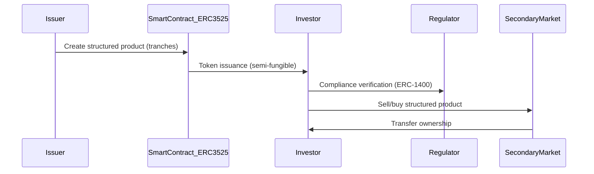
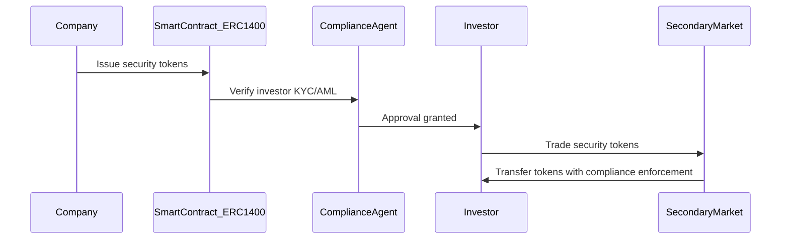
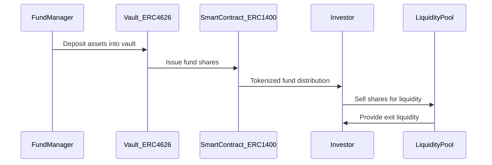
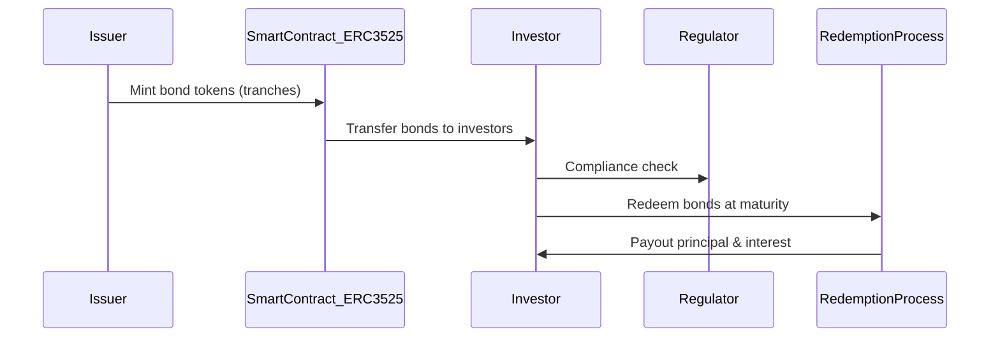
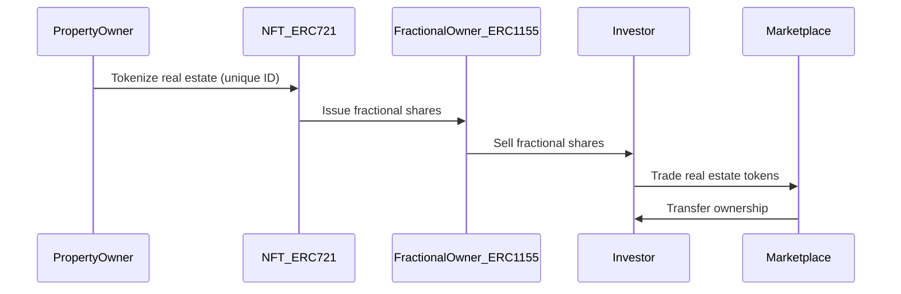
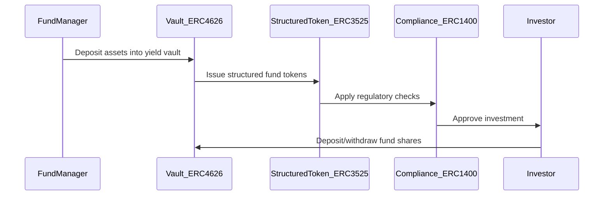

# ERC Metadata

Date: February 26, 2025 6:30 PM
Status: Not started

Here’s a detailed comparison of the ERC standards, including their **metadata, functions, and use cases**:

| **ERC Standard** | **Metadata** | **Functions** | **Use Cases** |
| --- | --- | --- | --- |
| **ERC-20** (Fungible Token) | - `name`: Token name - `symbol`: Token symbol - `decimals`: Precision of token (e.g., 18 decimals) | - `totalSupply()`: Total token supply - `balanceOf(address)`: Get balance of an address - `transfer(to, amount)`: Transfer tokens - `approve(spender, amount)`: Allow another address to spend on behalf - `transferFrom(from, to, amount)`: Move tokens based on allowance - `allowance(owner, spender)`: Get remaining allowance | - Cryptocurrencies (ETH, USDC, DAI) - Utility tokens - Governance tokens - Payment and settlement systems |
| **ERC-721** (Non-Fungible Token - NFT) | - `name`: Token name - `symbol`: Token symbol - `tokenURI(tokenId)`: Metadata URI | - `balanceOf(owner)`: Get number of NFTs owned - `ownerOf(tokenId)`: Get owner of a specific NFT - `transferFrom(from, to, tokenId)`: Transfer ownership - `approve(spender, tokenId)`: Allow another address to transfer the NFT - `setApprovalForAll(operator, approved)`: Approve multiple transfers - `getApproved(tokenId)`: Check approved address | - Digital art & collectibles - Real estate tokenization - In-game assets - Event ticketing |
| **ERC-1155** (Multi-Token Standard) | - `uri(id)`: Metadata URI for each token ID - Supports both fungible & non-fungible tokens | - `balanceOf(owner, id)`: Get balance of specific token ID - `safeTransferFrom(from, to, id, amount, data)`: Transfer multiple token types - `safeBatchTransferFrom(from, to, ids[], amounts[], data)`: Batch transfer - `setApprovalForAll(operator, approved)`: Approve batch transfers | - Gaming assets (fungible & NFTs) - Multi-asset DeFi applications - Fractional ownership |
| **ERC-1400**(Security Token Standard) | - `name`: Token name - `symbol`: Token symbol - `decimals`: Token precision - `partitionedSupply(partition)`: Supply per partition - `documents()`: Legal & compliance data | - `transferByPartition(from, to, partition, amount, data)`: Transfer within a specific partition - `balanceOfByPartition(owner, partition)`: Get balance in partition - `canTransfer(partition, from, to, amount, data)`: Compliance check - `issueByPartition(partition, to, amount, data)`: Issue security tokens | - Security token issuance (STOs) - Compliance-driven digital assets - Regulated tokenized securities |
| **ERC-3525** (Semi-Fungible Token) | - `name`: Token name - `symbol`: Token symbol - `valueDecimals`: Precision for fractionalization - `slot(tokenId)`: Identifies shared attributes across tokens | - `balanceOf(owner)`: Get balance of an owner - `transferFrom(from, to, tokenId, value)`: Transfer with fractional value - `split(tokenId, value)`: Split a token into smaller parts - `merge(tokenId1, tokenId2)`: Merge multiple tokens - `approve(spender, value)`: Approve transfers | - Bonds & structured finance products - Subscription-based NFTs - Loyalty and reward systems |
| **ERC-4626**(Tokenized Vault Standard) | - `name`: Token name - `symbol`: Token symbol - `asset()`: Underlying asset type - `totalAssets()`: Total assets held in vault | - `deposit(amount, receiver)`: Deposit assets into vault - `withdraw(amount, receiver, owner)`: Withdraw from vault - `convertToShares(amount)`: Convert deposits to vault shares - `convertToAssets(shares)`: Convert shares to underlying assets - `maxWithdraw(owner)`: Get max allowable withdrawal | - Yield-bearing vaults - Liquidity staking (stETH, pxETH) - Automated asset management |

### **Key Takeaways:**

- **ERC-20**: Standard for fungible tokens (used in cryptocurrencies & DeFi).
- **ERC-721**: NFT standard, each token is unique.
- **ERC-1155**: Hybrid standard supporting both fungible and non-fungible tokens.
- **ERC-1400**: Security token standard ensuring regulatory compliance.
- **ERC-3525**: Semi-fungible standard, useful for structured finance and fractionalized assets.
- **ERC-4626**: Tokenized vaults for DeFi strategies and automated yield management.

### **Metadata Editor with Dynamic Fields by Token Standard**

The **metadata editor** is a configurable interface that adapts its fields based on the selected **token standard**, ensuring that each token type has the appropriate attributes for its functionality and compliance.

---

## **1. ERC-20 Metadata Editor (Fungible Token)**

> Purpose: Standardized fungible tokens used for payments, governance, and DeFi applications.
> 

### **Fields & Functions:**

| **Field** | **Description** | **Editable?** |
| --- | --- | --- |
| **Name** | Token’s display name (e.g., "USD Coin") | ✅ |
| **Symbol** | Short symbol for identification (e.g., "USDC") | ✅ |
| **Description** | Token details and use case summary | ✅ |
| **Total Supply** | Maximum number of tokens issued (fixed or unlimited) | ✅ (if minting allowed) |
| **Contract Address** | Smart contract address on-chain | ❌ (auto-generated) |
| **Decimals** | Number of decimal places the token supports (default: 18) | ✅ |

### **Advanced Settings:**

- **Mintable**: Toggle whether new tokens can be created.
- **Burnable**: Toggle whether tokens can be destroyed.
- **Pausable**: Enable emergency stop functionality.
- **Transfer Restrictions**: Limit transfers based on compliance rules.

---

## **2. ERC-721 Metadata Editor (Non-Fungible Token - NFT)**

> Purpose: Unique, non-fungible assets used for collectibles, digital art, real estate, and in-game assets.
> 

### **Fields & Functions:**

| **Field** | **Description** | **Editable?** |
| --- | --- | --- |
| **Name** | Name of the NFT collection (e.g., "CryptoPunks") | ✅ |
| **Symbol** | Short token identifier (e.g., "PUNK") | ✅ |
| **Description** | Summary of the NFT’s purpose or attributes | ✅ |
| **Image URL** | URI pointing to the digital asset | ✅ |
| **Attributes** | Key-value pairs for metadata (e.g., Rarity, Color, Level) | ✅ |
| **Token ID** | Unique identifier for each NFT | ❌ (auto-generated) |
| **Owner Address** | Address of the current owner | ❌ (auto-tracked) |

### **Advanced Settings:**

- **Royalties**: Define royalty percentage for secondary sales.
- **Transferability**: Restrict transfers (whitelist, lock period).
- **Custom Metadata URI**: Allow off-chain metadata linking.

---

## **3. ERC-1155 Metadata Editor (Multi-Token Standard)**

> Purpose: Supports multiple asset types (fungible, semi-fungible, non-fungible) in a single contract.
> 

### **Fields & Functions:**

| **Field** | **Description** | **Editable?** |
| --- | --- | --- |
| **Name** | Collection or asset name | ✅ |
| **Token Type** | Define as Fungible, Semi-Fungible, or Non-Fungible | ✅ |
| **Amount** | Quantity of tokens issued per ID (if fungible/semi-fungible) | ✅ |
| **URI** | Metadata link (JSON format) | ✅ |
| **Burnable** | Toggle to allow token destruction | ✅ |
| **Transferable** | Toggle to allow transfers or restrict ownership | ✅ |

### **Advanced Settings:**

- **Batch Transfer Support**: Enable moving multiple tokens at once.
- **Supply Cap**: Limit total issuance per token ID.
- **Nested Ownership**: Enable holding other assets (for gaming).

---

## **4. ERC-1400 Metadata Editor (Security Token Standard)**

> Purpose: Designed for regulatory-compliant security tokens with transfer restrictions.
> 

### **Fields & Functions:**

| **Field** | **Description** | **Editable?** |
| --- | --- | --- |
| **Name** | Security token name (e.g., "Tokenized Bond 2025") | ✅ |
| **Symbol** | Short ticker symbol | ✅ |
| **Jurisdiction** | Regulatory region (e.g., US, EU, SG) | ✅ |
| **Whitelist Requirements** | Compliance details (e.g., KYC/AML, accreditation) | ✅ |
| **Issuance Date** | Start date of issuance | ✅ |
| **Maturity Date** | Date when redemption occurs | ✅ |

### **Advanced Settings:**

- **Transfer Restrictions**: Limit trading to KYC-verified wallets.
- **Lock-up Periods**: Prevent early selling.
- **Compliance Modules**: Auto-restrict based on investor type.

---

## **5. ERC-3525 Metadata Editor (Semi-Fungible Token)**

> Purpose: Allows fractionalized and parameterized ownership, suitable for bonds, memberships, and subscriptions.
> 

### **Fields & Functions:**

| **Field** | **Description** | **Editable?** |
| --- | --- | --- |
| **Name** | Token name | ✅ |
| **Symbol** | Short identifier | ✅ |
| **Token ID** | Unique identifier within slot groups | ❌ (auto-generated) |
| **Slot** | Shared attribute identifier for token grouping | ✅ |
| **Value** | Numeric amount representing holdings (e.g., shares, credits) | ✅ |
| **Interest Rate** | Applicable rate for yield-bearing tokens | ✅ |

### **Advanced Settings:**

- **Split/Merge Functionality**: Enable dynamic token management.
- **Redeemable Value**: Set rules for cashing out.
- **Expiration**: Auto-revoke tokens on a set date.

---

### **Implementation & UX Considerations**

1. **Auto-Populated Fields**:
    - Contract addresses and token IDs should be auto-generated.
    - Standardized default values for decimals, supply, and compliance.
2. **Modular Configuration**:
    - Fields dynamically show/hide based on token standard.
    - Users can predefine advanced settings.
3. **User-Friendly UI Enhancements**:
    - **Live Preview**: Display how metadata will appear on marketplaces.
    - **Template Importing**: Allow bulk uploads for batch token creation.
    - **Validation Checks**: Ensure metadata consistency before deploying.

---

### **6. ERC-4626 Metadata Editor (Tokenized Vault Standard)**

> Purpose: A standard for yield-bearing vaults, automating deposits, withdrawals, and asset conversionsfor lending, staking, and structured DeFi products.
> 

### **Fields & Functions**

| **Field** | **Description** | **Editable?** |
| --- | --- | --- |
| **Name** | Vault name (e.g., "Yield Fund Alpha") | ✅ |
| **Symbol** | Short identifier (e.g., "YFA") | ✅ |
| **Asset Type** | Underlying asset (e.g., USDC, ETH, pxETH) | ✅ |
| **Total Assets** | Total holdings in the vault | ❌ (auto-calculated) |
| **Total Supply** | Maximum supply of vault shares | ✅ (if minting enabled) |
| **Share Price** | Ratio of assets per share (NAV) | ❌ (auto-tracked) |
| **Withdrawal Limit** | Maximum funds that can be withdrawn at once | ✅ |
| **Deposit Limit** | Maximum capital intake per deposit | ✅ |
| **Performance Fee** | Percentage deducted from yield | ✅ |

---

### **Vault-Specific Advanced Settings**

| **Feature** | **Description** |
| --- | --- |
| **Yield Strategy** | Specifies yield source (e.g., staking, lending, arbitrage). |
| **Compounding** | Auto-reinvests profits back into the vault. |
| **Withdrawal Restrictions** | Enforce lock-up periods or gradual withdrawals. |
| **Auto-Rebalancing** | Adjusts portfolio to maintain asset allocation. |
| **Dynamic NAV Calculation** | Updates share price based on accrued returns. |

---

### **Vault-Specific Functions**

| **Function** | **Description** |
| --- | --- |
| `deposit(amount, receiver)` | Adds funds to the vault, minting equivalent shares. |
| `withdraw(amount, receiver, owner)` | Removes funds, burning equivalent shares. |
| `convertToShares(amount)` | Calculates how many shares correspond to a given asset amount. |
| `convertToAssets(shares)` | Converts shares back into their equivalent asset value. |
| `maxWithdraw(owner)` | Returns the maximum amount a user can withdraw. |
| `maxDeposit(owner)` | Returns the maximum amount a user can deposit. |

---

### **Use Cases for ERC-4626**

1. **Yield Vaults**: Automatically stake tokens (e.g., pxETH, stETH).
2. **Lending Markets**: Wrap deposited funds into interest-bearing tokens.
3. **Tokenized Hedge Funds**: Allow investors to deposit assets into structured DeFi strategies.
4. **Liquidity Pool Aggregators**: Auto-rebalance between different pools (e.g., Curve, Aave).
5. **Collateralized Lending**: Users deposit stablecoins and earn passive income.

---

### **User Experience & UI Enhancements**

1. **Live APY Tracker**: Displays real-time yield performance.
2. **Dynamic Withdrawal Sliders**: Adjust withdrawal amount based on NAV.
3. **Strategy Breakdown Panel**: Shows allocation of underlying assets.
4. **Auto-Compound Toggle**: Allows users to reinvest automatically.

---

### **Slots and Slot Groups in Token Standards (ERC-3525 & Beyond)**

### **1. What is a Slot in ERC-3525?**

A **slot** in ERC-3525 represents a **category, classification, or shared attribute** that groups semi-fungible tokens (SFTs). Unlike ERC-721 (where each token is unique) or ERC-20 (where all tokens are interchangeable), ERC-3525 uses **slots** to organize **tokens with similar properties but different values**.

Each token in ERC-3525 has:

- **A unique Token ID** (like ERC-721).
- **A slot value**, which groups it with other tokens sharing a common trait.
- **A numeric balance** (like ERC-20), meaning the token can be divided into fractional amounts.

📌 **Think of slots as "account types" or "asset categories" that tokens belong to.**

### **2. Example of Slots in Real-World Use Cases**

| **Use Case** | **Slot Example** |
| --- | --- |
| **Bond Issuance** | Each slot represents a different **bond series** (e.g., "Corporate Bond 2025" vs. "Treasury Bond 2030"). |
| **Subscription NFTs** | Slot groups define different membership tiers (e.g., "Gold Membership" vs. "Platinum Membership"). |
| **Loyalty Rewards** | Slot represents a different rewards program (e.g., "Airline Points" vs. "Hotel Points"). |
| **Savings Accounts** | Slot represents different interest rates (e.g., "5% APY Vault" vs. "10% APY Vault"). |

---

### **3. What are Slot Groups?**

A **slot group** is a **collection of tokens that share the same slot value** but have different balances or owners.

- **Each slot group aggregates all tokens under a given slot.**
- **Tokens in the same slot group can be merged, split, or transferred independently.**

🛠 **Key Feature: Slot-Based Operations**

- **Splitting**: Break a token into smaller values while keeping the same slot.
- **Merging**: Combine multiple tokens into one larger value within the same slot.
- **Transferring**: Move only part of a token’s balance without changing its slot.

---

### **4. Slot Example in ERC-3525 Smart Contracts**

### 📌 **Scenario: A Tokenized Bond System**

Let's say we issue **corporate bonds** where each bond belongs to a specific **interest rate tier**.

| **Token ID** | **Slot (Bond Type)** | **Balance (Bond Value)** | **Owner** |
| --- | --- | --- | --- |
| 1001 | **5% Fixed Rate Bond** | $10,000 | Alice |
| 1002 | **5% Fixed Rate Bond** | $15,000 | Bob |
| 1003 | **7% Fixed Rate Bond** | $20,000 | Charlie |
| 1004 | **7% Fixed Rate Bond** | $30,000 | Dave |

🔹 **Slot Groups:**

- Token 1001 and 1002 belong to **Slot 5% Fixed Rate Bond**.
- Token 1003 and 1004 belong to **Slot 7% Fixed Rate Bond**.
- **Bob** could merge his token (1002) with Alice’s (1001), creating a $25,000 bond under the same **5% slot**.

---

### **5. Key Benefits of Using Slots in ERC-3525**

✅ **Efficient Categorization** → Group similar tokens (e.g., bond series, financial instruments).

✅ **Fractional Ownership** → Unlike ERC-721, ERC-3525 allows tokens to **store values and be split**.

✅ **Programmability** → Developers can define slot-based logic for automated transfers, staking, and other DeFi functions.

✅ **Structured Finance Support** → Works well for **bonds, loans, insurance, and subscription-based assets**.

Here’s an optimal **ERC standard recommendation** for each product category, considering the specific requirements of **fungibility, ownership, compliance, and structured finance**.

---

## **1. Traditional Assets**

| **Product** | **Recommended ERC Standard(s)** | **Justification** |
| --- | --- | --- |
| **Structured Products** | **ERC-3525, ERC-1400** | ERC-3525 enables **semi-fungible tokenization** for tranches, structured investments, and capital distributions. ERC-1400 ensures **regulatory compliance** and restricted transfers. |
| **Equity (Stocks, Shares)** | **ERC-1400, ERC-3643** | ERC-1400 enforces **whitelist-based transfers**, making it suitable for **regulated securities**. ERC-3643 (built on ERC-1400) enhances **permissioned trading**. |
| **Commodities (Gold, Oil)** | **ERC-20, ERC-1400, ERC-1155** | ERC-20 fits **fungible commodities** (gold, oil). ERC-1400 ensures **whitelisted commodity-backed tokens**. ERC-1155 allows **multi-asset fungibility** (e.g., tokenized barrels of oil & gold bars in one contract). |
| **Funds, ETFs, ETPs** | **ERC-4626, ERC-1400** | ERC-4626 standardizes **vault-based asset management**. ERC-1400 ensures **compliance for fund shares**. |
| **Bonds** | **ERC-3525, ERC-1400** | ERC-3525 supports **bond tranches and semi-fungible debt issuance**. ERC-1400 enables **whitelist-based institutional bonds**. |
| **Quantitative Investment Strategies** | **ERC-4626, ERC-3525** | ERC-4626 vaults optimize **yield-bearing structured strategies**. ERC-3525 enables **structured financial instruments**. |

---

## **2. Alternative Assets**

| **Product** | **Recommended ERC Standard(s)** | **Justification** |
| --- | --- | --- |
| **Private Equity** | **ERC-1400, ERC-3643, ERC-3525** | ERC-1400 supports **permissioned security tokens**. ERC-3643 adds **extra compliance layers**. ERC-3525 allows **semi-fungible ownership units**. |
| **Private Debt** | **ERC-3525, ERC-1400** | ERC-3525 tokenizes **loan agreements, debt tranches, and convertible instruments**. ERC-1400 ensures **regulated issuance**. |
| **Real Estate** | **ERC-721, ERC-1400, ERC-1155** | ERC-721 for **unique properties**, ERC-1155 for **fractional ownership**, ERC-1400 for **securitization & REITs**. |
| **Energy (Carbon Credits, Renewable Energy Assets)** | **ERC-1155, ERC-1400** | ERC-1155 supports **fungible & non-fungible energy certificates**. ERC-1400 enforces **regulatory compliance**. |
| **Infrastructure** | **ERC-3525, ERC-1400** | ERC-3525 allows **semi-fungible ownership** of infrastructure projects (bridges, toll roads). ERC-1400 ensures **compliance in financing**. |
| **Collectibles & Luxury Assets** | **ERC-721, ERC-1155** | ERC-721 tokenizes **unique assets** (art, watches). ERC-1155 supports **fractionalized ownership**. |

---

## **3. Digital Assets**

| **Product** | **Recommended ERC Standard(s)** | **Justification** |
| --- | --- | --- |
| **Digital Tokenized Fund** | **ERC-4626, ERC-1400, ERC-3525** | ERC-4626 supports **yield-bearing fund structures**. ERC-1400 ensures **institutional compliance**. ERC-3525 allows **multi-tiered share classes**. |

---

### **Key Takeaways**

✅ **ERC-1400 & ERC-3643** → Best for regulated **securities, bonds, and funds**.

✅ **ERC-3525** → Ideal for **structured finance, tranches, and semi-fungible assets**.

✅ **ERC-4626** → Best for **funds, ETFs, and automated yield vaults**.

✅ **ERC-1155** → Useful for **multi-asset tokenization (commodities, energy, fractional assets)**.

✅ **ERC-721** → Perfect for **unique asset ownership (real estate, collectibles, art, NFTs)**.

### **Workflow Diagrams to be Created:**

1. **Structured Products (ERC-3525 + ERC-1400)** → Tranche-based structured finance issuance.
2. **Equity & Private Securities (ERC-1400 + ERC-3643)** → Regulated security token issuance.
3. **Funds & ETFs (ERC-4626 + ERC-1400)** → Tokenized investment fund flow.
4. **Bonds (ERC-3525 + ERC-1400)** → Bond issuance, secondary trading, and redemption.
5. **Real Estate (ERC-721 + ERC-1400 + ERC-1155)** → Tokenized property and fractional ownership.
6. **Digital Tokenized Funds (ERC-4626 + ERC-3525 + ERC-1400)** → NAV-based fund tokenization.

Here are **workflow diagrams** illustrating how different **ERC standards interact in tokenized finance structures**:

1. **Structured Products (ERC-3525 + ERC-1400)** → Shows the issuance and trading of tranche-based structured finance instruments.
2. **Equity & Private Securities (ERC-1400 + ERC-3643)** → Demonstrates compliance-driven security token issuance.
3. **Funds & ETFs (ERC-4626 + ERC-1400)** → Depicts NAV-based fund tokenization and investor interactions.
4. **Bonds (ERC-3525 + ERC-1400)** → Illustrates bond issuance, compliance, and redemption flows.
5. **Real Estate (ERC-721 + ERC-1400 + ERC-1155)** → Highlights how real estate ownership and fractionalization work in a tokenized framework.
6. **Digital Tokenized Funds (ERC-4626 + ERC-3525 + ERC-1400)** → Represents the interaction between **yield vaults, structured finance tokens, and compliance layers**.

### **1. Structured Products (ERC-3525 + ERC-1400)**

- **Use Case**: Issuing and trading structured finance products with tranches.



---

### **2. Equity & Private Securities (ERC-1400 + ERC-3643)**

- **Use Case**: Issuance and trading of security tokens with compliance enforcement.



---

### **3. Funds & ETFs (ERC-4626 + ERC-1400)**

- **Use Case**: Tokenized investment fund with automated deposits and withdrawals.



---

### **4. Bonds (ERC-3525 + ERC-1400)**

- **Use Case**: Issuance, trading, and redemption of tokenized bonds.



---

### **5. Real Estate (ERC-721 + ERC-1400 + ERC-1155)**

- **Use Case**: Tokenized real estate ownership and fractionalization.



---

### **6. Digital Tokenized Funds (ERC-4626 + ERC-3525 + ERC-1400)**

- **Use Case**: Tokenized fund integrating structured products and compliance layers.



---

### **Key Takeaways**

✅ **ERC-3525** → Best for **tranches, structured finance, and semi-fungible bonds**.

✅ **ERC-1400 + ERC-3643** → Ideal for **security tokens and compliance enforcement**.

✅ **ERC-4626** → Perfect for **fund tokenization, vault-based strategies, and NAV-based shares**.

✅ **ERC-721 + ERC-1155** → Enables **real estate tokenization with unique and fractional ownership**.

### **Detailed Explanation of the Sequence Diagrams**

Each sequence diagram represents a **tokenized finance structure** where different **ERC standards** interact. Below, I will break down **each step in detail**, explaining what happens and how it occurs.

---

## **1. Structured Products (ERC-3525 + ERC-1400)**

> Use Case: Issuing and trading structured finance products with tranches.
> 

### **How It Works:**

1. **Issuer creates a structured product**
    - The issuer deploys a **smart contract** implementing **ERC-3525**, which supports **semi-fungible tranches**.
    - The product may represent a **structured note, credit-linked note (CLN), or asset-backed security (ABS)**.
2. **Smart contract issues tranche-based tokens**
    - Each token **belongs to a specific slot**, defining different tranches (e.g., **AAA, BBB, CCC risk levels**).
    - These tokens can be **split, merged, or transferred** within the same slot.
3. **Investor purchases structured product tokens**
    - Investors buy tokens representing **specific risk-return profiles**.
4. **Regulator verifies compliance (ERC-1400 integration)**
    - The **ERC-1400 module checks KYC/AML compliance** before allowing transfers.
    - Only **whitelisted investors** can hold certain structured tranches.
5. **Investor sells on the secondary market**
    - Tranche-based structured product tokens can be sold on a **compliant secondary market**, following **ERC-1400 restrictions**.
    - The marketplace checks that only **eligible investors** can receive transfers.

---

## **2. Equity & Private Securities (ERC-1400 + ERC-3643)**

> Use Case: Issuance and trading of security tokens with compliance enforcement.
> 

### **How It Works:**

1. **Company issues shares as security tokens**
    - A **smart contract (ERC-1400)** is deployed to tokenize **equity** (common stock, preferred stock).
2. **Compliance agent verifies investor identity**
    - The **ERC-1400 security token framework** requires investors to be **KYC/AML verified**.
    - A **compliance agent (external or on-chain verifier)** checks investor eligibility.
3. **Investor receives equity tokens**
    - Once approved, the investor gets **tokenized shares**, which function like traditional securities.
4. **Investor trades tokens on the secondary market**
    - The investor can **sell shares on a security token exchange** (STO marketplace).
    - **ERC-1400 ensures that only accredited investors** can receive the transfer.

---

## **3. Funds & ETFs (ERC-4626 + ERC-1400)**

> Use Case: Tokenized investment fund with automated deposits and withdrawals.
> 

### **How It Works:**

1. **Fund manager deposits assets into the vault**
    - The **ERC-4626 vault** holds **liquid or illiquid assets** (e.g., stablecoins, treasuries, credit fund investments).
    - The vault calculates **Net Asset Value (NAV)** to issue proportional fund shares.
2. **Vault issues ERC-1400 security tokens**
    - Investors receive **tokenized fund shares** that comply with **fund regulations**.
3. **Investor buys fund shares**
    - Investors **deposit capital** to acquire ERC-1400 security tokens representing the fund.
4. **Investor sells shares for liquidity**
    - Investors can **exit** the fund by **redeeming** shares in the **ERC-4626 vault** or selling them in a **secondary market**.
5. **Liquidity pool provides exit liquidity**
    - The fund may connect to **DeFi liquidity pools** (e.g., Curve, Balancer) to enable **automated redemptions**.

---

## **4. Bonds (ERC-3525 + ERC-1400)**

> Use Case: Issuance, trading, and redemption of tokenized bonds.
> 

### **How It Works:**

1. **Issuer mints bond tokens (ERC-3525 slots for different maturities)**
    - The issuer creates bond tokens with different **tranches and interest rates** (e.g., 3-year vs. 5-year bonds).
2. **Investor purchases bonds**
    - Investors **buy bond tokens** with the principal amount locked for a fixed period.
3. **Regulator verifies compliance**
    - ERC-1400 ensures that only **approved investors** can hold the bond.
4. **Investor redeems bonds at maturity**
    - On **maturity**, the **ERC-3525 contract burns the token** and releases **principal + interest payments**.

---

## **5. Real Estate (ERC-721 + ERC-1400 + ERC-1155)**

> Use Case: Tokenized real estate ownership and fractionalization.
> 

### **How It Works:**

1. **Property owner tokenizes real estate using ERC-721**
    - Each property is **minted as an NFT (ERC-721)** with unique metadata (address, deed, valuation).
2. **Fractionalization using ERC-1155**
    - The NFT owner can **split ownership** into **fractional tokens** (ERC-1155), enabling **multiple investors** to co-own the property.
3. **Investors purchase fractional shares**
    - Investors can **buy ERC-1155 tokens**, which represent **partial ownership** in the real estate asset.
4. **Marketplace facilitates transactions**
    - The tokenized real estate is **listed on a regulated marketplace**, allowing fractional owners to trade their shares.

---

## **6. Digital Tokenized Funds (ERC-4626 + ERC-3525 + ERC-1400)**

> Use Case: NAV-based tokenized fund integrating structured finance and compliance layers.
> 

### **How It Works:**

1. **Fund manager deposits assets into an ERC-4626 vault**
    - The vault holds **capital** and invests in yield-generating strategies (e.g., staking, credit lending).
2. **Vault issues structured ERC-3525 fund tokens**
    - The **ERC-3525 tokens represent different fund share classes**, allowing for **semi-fungible NAV-based shares**.
3. **Compliance verification (ERC-1400 enforced)**
    - Before receiving fund tokens, investors must **pass compliance checks** (KYC, accreditation).
4. **Investor deposits and withdraws shares**
    - Investors can **deposit capital to mint fund shares** and **redeem them later** for the underlying value.

---

## **Key Takeaways from These Workflows**

- ✅ **ERC-1400 & ERC-3643** → Ensure **compliance, KYC/AML enforcement, and restricted transfers** for regulated assets.
- ✅ **ERC-3525** → Ideal for **structured finance products, bond tranches, and semi-fungible asset classes**.
- ✅ **ERC-4626** → Standardizes **tokenized funds, ETFs, and NAV-based vaults**.
- ✅ **ERC-721 + ERC-1155** → Supports **real estate tokenization and fractional ownership**.

# Technical Implementation Guide: Meta Editor for ERC Token Standards

## **1. Overview**

This guide provides a **comprehensive smart contract implementation strategy** and **metadata samples** for a **Meta Editor** that dynamically supports multiple ERC token standards:

- **ERC-20** (Fungible Tokens)
- **ERC-721** (Non-Fungible Tokens)
- **ERC-1155** (Multi-Token Standard)
- **ERC-1400** (Security Tokens)
- **ERC-3525** (Semi-Fungible Tokens)
- **ERC-4626** (Tokenized Vaults)

The **Meta Editor** should allow users to create, modify, and manage token metadata in a standardized and user-friendly manner.

---

## **2. Smart Contract Implementation for Each ERC Standard**

### **2.1 ERC-20 (Fungible Tokens)**

### **Smart Contract (Solidity)**

```
// SPDX-License-Identifier: MIT
pragma solidity ^0.8.20;

import "@openzeppelin/contracts/token/ERC20/ERC20.sol";
import "@openzeppelin/contracts/access/Ownable.sol";

contract MetaERC20 is ERC20, Ownable {
    uint8 private _decimals;

    constructor(string memory name, string memory symbol, uint256 initialSupply, uint8 decimals_)
        ERC20(name, symbol)
    {
        _mint(msg.sender, initialSupply * (10 ** decimals_));
        _decimals = decimals_;
    }

    function decimals() public view override returns (uint8) {
        return _decimals;
    }
}
```

### **Metadata Structure**

```
{
  "name": "Meta Token",
  "symbol": "META",
  "description": "A fungible ERC-20 token",
  "totalSupply": "1000000",
  "decimals": "18",
  "contractAddress": "0x...",
  "owner": "0x..."
}
```

---

### **2.2 ERC-721 (Non-Fungible Tokens - NFTs)**

### **Smart Contract (Solidity)**

```
// SPDX-License-Identifier: MIT
pragma solidity ^0.8.20;

import "@openzeppelin/contracts/token/ERC721/extensions/ERC721URIStorage.sol";
import "@openzeppelin/contracts/access/Ownable.sol";

contract MetaERC721 is ERC721URIStorage, Ownable {
    uint256 private _nextTokenId;

    constructor(string memory name, string memory symbol) ERC721(name, symbol) {}

    function mint(address to, string memory tokenURI) external onlyOwner {
        _safeMint(to, _nextTokenId);
        _setTokenURI(_nextTokenId, tokenURI);
        _nextTokenId++;
    }
}
```

### **Metadata Structure**

```
{
  "name": "Meta NFT",
  "symbol": "MNFT",
  "description": "A non-fungible ERC-721 token",
  "image": "https://example.com/token.png",
  "attributes": {
    "rarity": "Legendary",
    "color": "Gold"
  },
  "contractAddress": "0x..."
}
```

---

### **2.3 ERC-1155 (Multi-Token Standard)**

### **Smart Contract (Solidity)**

```
// SPDX-License-Identifier: MIT
pragma solidity ^0.8.20;

import "@openzeppelin/contracts/token/ERC1155/extensions/ERC1155Burnable.sol";
import "@openzeppelin/contracts/access/Ownable.sol";

contract MetaERC1155 is ERC1155Burnable, Ownable {
    uint256 public constant TOKEN_ID = 1;

    constructor() ERC1155("https://example.com/meta/{id}.json") {
        _mint(msg.sender, TOKEN_ID, 100, "");
    }
}
```

### **Metadata Structure**

```
{
  "name": "Meta Multi-Token",
  "description": "A fungible/non-fungible ERC-1155 token",
  "uri": "https://example.com/meta/1.json",
  "amount": "100",
  "burnable": true,
  "transferable": true,
  "contractAddress": "0x..."
}
```

---

### **2.4 ERC-1400 (Security Tokens)**

### **Smart Contract (Solidity)**

```
// SPDX-License-Identifier: MIT
pragma solidity ^0.8.20;

import "@openzeppelin/contracts/token/ERC20/ERC20.sol";
import "@openzeppelin/contracts/access/AccessControl.sol";

contract MetaERC1400 is ERC20, AccessControl {
    bytes32 public constant REGULATOR_ROLE = keccak256("REGULATOR_ROLE");

    constructor(string memory name, string memory symbol, uint256 initialSupply) ERC20(name, symbol) {
        _mint(msg.sender, initialSupply);
        _setupRole(DEFAULT_ADMIN_ROLE, msg.sender);
    }

    function enforceCompliance(address investor) external view returns (bool) {
        return hasRole(REGULATOR_ROLE, investor);
    }
}
```

### **Metadata Structure**

```
{
  "name": "Meta Security Token",
  "symbol": "MST",
  "description": "A regulatory-compliant security token",
  "jurisdiction": "US",
  "whitelist": ["0xabc...", "0xdef..."],
  "issuanceDate": "2025-01-01",
  "maturityDate": "2030-01-01",
  "contractAddress": "0x..."
}
```

---

### **2.5 ERC-3525 (Semi-Fungible Tokens)**

### **Smart Contract (Solidity)**

```
// SPDX-License-Identifier: MIT
pragma solidity ^0.8.20;

import "@openzeppelin/contracts/token/ERC3525/ERC3525.sol";

contract MetaERC3525 is ERC3525 {
    constructor() ERC3525("Meta Semi-Fungible Token", "MSF", 18) {}
}
```

### **Metadata Structure**

```
{
  "name": "Meta Semi-Fungible Token",
  "description": "A semi-fungible ERC-3525 token",
  "slot": "Fixed Income Asset",
  "tokenId": "1",
  "value": "50000",
  "interestRate": "5%",
  "contractAddress": "0x..."
}
```

---

### **2.6 ERC-4626 (Tokenized Vaults)**

### **Smart Contract (Solidity)**

```
// SPDX-License-Identifier: MIT
pragma solidity ^0.8.20;

import "@openzeppelin/contracts/token/ERC4626/ERC4626.sol";
import "@openzeppelin/contracts/token/ERC20/ERC20.sol";

contract MetaERC4626 is ERC4626 {
    constructor(ERC20 asset) ERC4626(asset) ERC20("Meta Vault", "MVAULT") {}
}
```

### **Metadata Structure**

```
{
  "name": "Meta Vault",
  "description": "A tokenized vault (ERC-4626)",
  "asset": "USDC",
  "totalAssets": "1000000",
  "withdrawalLimit": "50000",
  "performanceFee": "2%",
  "contractAddress": "0x..."
}
```

---